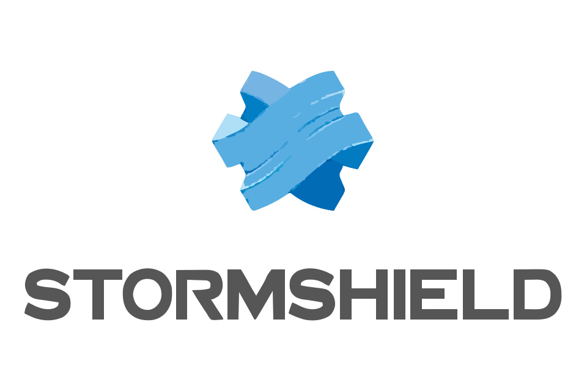
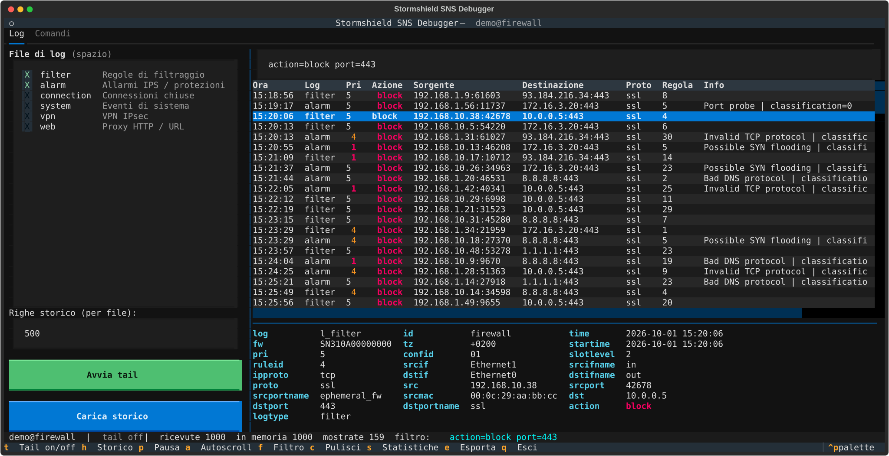

<div align="center">



# SNS Debugger

**A terminal UI to read and troubleshoot Stormshield Network Security (SNS) firewall logs over SSH.**


</div>

> [!IMPORTANT]
> **This is an unofficial, community-built and community-maintained project.**
> It is **not** developed, endorsed, supported or affiliated in any way with Stormshield
> or Airbus. Do not contact Stormshield support about this tool — open an issue in this
> repository instead.
>
> "Stormshield" and "SNS" are trademarks of their respective owners and are used here
> only to describe which products this tool works with.

---



## Why

Reading SNS logs from the web UI or from a raw `tail` over SSH is fine until you need to
answer *"why is this host being blocked, by which rule, right now?"*. SNS Debugger connects
to the firewall over SSH, streams the log files under `/log`, parses the `key=value`
format and gives you a filterable, colour-coded table in your terminal.

## Features

- **Live tail** of one or more log files at once (`l_filter`, `l_alarm`, `l_connection`,
  `l_vpn`, `l_web`, `l_system`, …), discovered automatically from the appliance.
- **History load** of the last *N* lines per file; if your filter contains a search term,
  the `grep` runs **on the firewall**, so even large files are fast.
- **Powerful filter**: free text, exclusions, `key=value` on any log field, CIDR matching,
  regular expressions.
- **Detail pane** showing every field of the selected log line.
- **Statistics** popup: top sources, destinations, ports, rules, messages and blocked hosts.
- **Command tab** to run diagnostic commands on the appliance with streamed output and a
  Stop button (great for `tcpdump`).
- **Export** of the filtered lines to a local file.
- **Demo mode** with synthetic logs — try the UI without a firewall.

## Requirements

- Linux (or any OS with a modern terminal) and **Python 3.10+**
- An SNS appliance with **SSH access enabled** and password authentication:
  *Configuration › System › Configuration › Firewall administration* →
  *Enable access by SSH* + *Use password authentication*.
- The `admin` account (log files are read from `/log`).

> [!NOTE]
> Filter logs (`l_filter`) only contain rules that have logging enabled in the filter policy.

## Installation

```bash
git clone https://github.com/<your-user>/sns-debugger.git
cd sns-debugger
./sns-debug --demo
```

The `sns-debug` launcher creates a local virtual environment (`.venv`) and installs the
dependencies ([Textual](https://github.com/Textualize/textual) and
[Paramiko](https://www.paramiko.org/)) on first run.

Manual setup, if you prefer:

```bash
python3 -m venv .venv
.venv/bin/pip install -r requirements.txt
.venv/bin/python stormshield_debugger.py
```

## Usage

```bash
./sns-debug                          # asks for firewall IP and password
./sns-debug 192.0.2.1                # asks for the password only
./sns-debug -u admin -p 2222 192.0.2.1
./sns-debug --demo                   # synthetic data, no firewall needed
```

The password is read with `getpass` and is never stored or written to disk.

### Keyboard shortcuts (Log tab)

| Key | Action |
|-----|--------|
| `space` | Select / unselect a log file in the sidebar |
| `t` | Start / stop live tail on the selected files |
| `h` | Load history (last *N* lines per file) |
| `f` or `/` | Focus the filter box (`Esc` returns to the table) |
| `p` | Pause display (lines keep being collected) |
| `a` | Toggle autoscroll |
| `s` | Statistics |
| `e` | Export filtered lines to `export_<timestamp>.log` |
| `c` | Clear |
| `q` | Quit |

### Filter syntax

Space-separated terms, all combined with **AND**:

| Term | Meaning |
|------|---------|
| `text` | line contains `text` (case-insensitive) |
| `-text` | line does **not** contain `text` |
| `field=value` | any log field, e.g. `action=block`, `ruleid=12`, `user=jdoe` |
| `field!=value` | field differs from value |
| `field~regex` | regular expression, e.g. `msg~"syn\|spoof"` |
| `src=10.0.0.0/24` | IP or CIDR match (`src`, `dst`, …) |
| `ip=192.0.2.10` | matches `src` **or** `dst` |
| `port=443` | matches `srcport` **or** `dstport` (numbers match exactly) |
| `log=alarm` | restrict to a log file |

Example — everything blocked from a subnet towards HTTPS, excluding DNS noise:

```
action=block src=10.10.0.0/16 port=443 -dns
```

### Command tab

Run commands on the appliance (`ifconfig`, `netstat -rn`, `tcpdump -n -c 50 -i <iface> host <ip>`, …).
Pick a preset on the left, edit it, press Enter. Long-running commands can be interrupted with **Stop**.

> [!WARNING]
> Commands run as `admin` on a production security device. Know what you are typing.

## Security notes

- The SSH host key fingerprint is printed at login but **not verified** against a
  `known_hosts` file. Check it the first time you connect.
- No credentials, logs or configuration are stored by the tool. Exported files are written
  only when you press `e`, in the current directory.

## Contributing

Issues and pull requests are welcome! This project lives thanks to the community:
bug reports with a (sanitised) sample log line are especially useful, since log formats
can vary between SNS versions.

Please **remove public IPs, serial numbers, usernames and any customer data** from log
samples before posting them.

## Disclaimer

This software is provided "as is", without warranty of any kind. It is an independent,
community-driven project and is not an official Stormshield product. Use it at your own
risk and in accordance with your organisation's policies.

## License

[MIT](LICENSE) © Stormshield Debugger contributors
